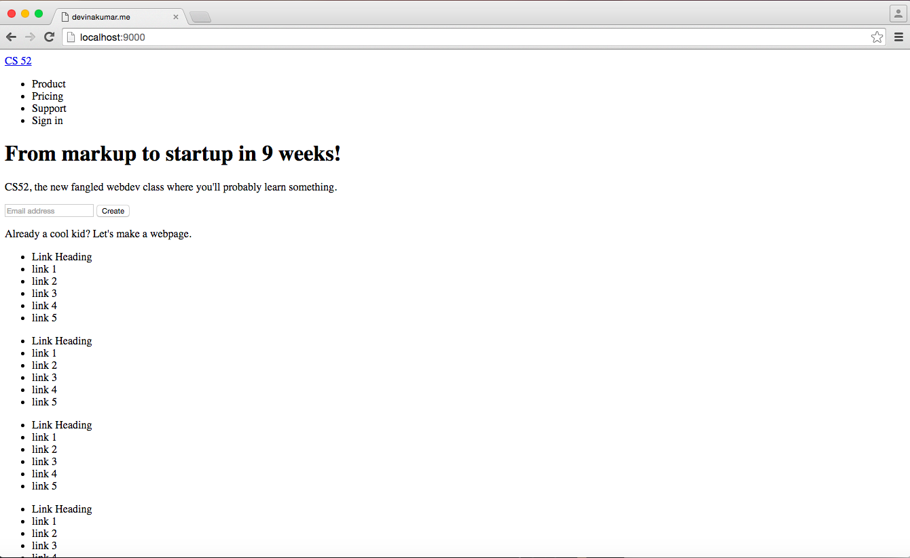
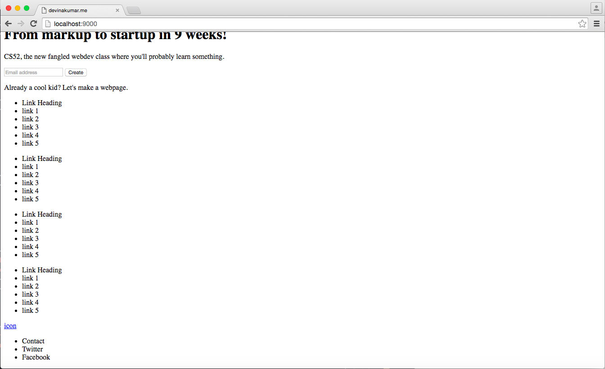
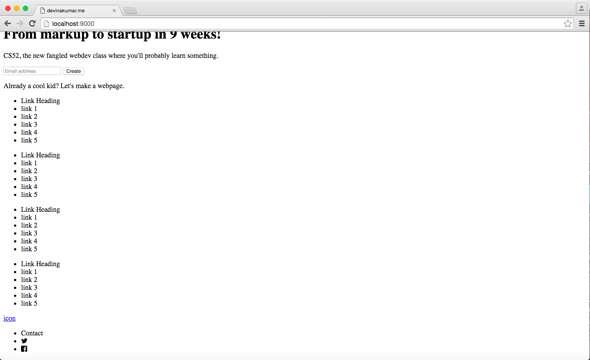
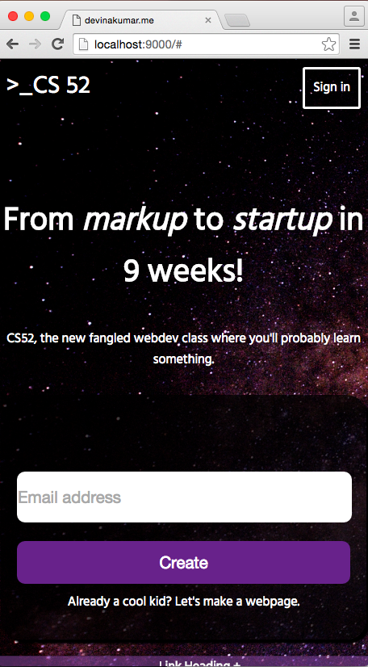
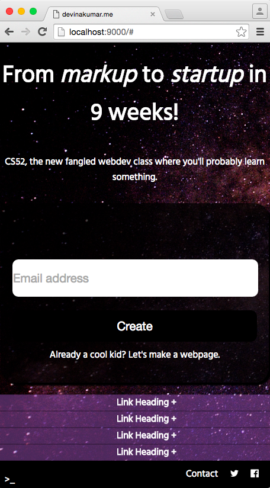

# cs52-hw1
Code for a landing page with HTML/CSS

This is a git repository for a landing page coded entirely in HTML and CSS.  I tested this landing page in Google Chrome.
For my landing page, I used primarily flexboxes to align all of the elements on my page.  The basic HTML layout mainly consisted of unordered lists with some inputs.

 The flexboxes allowed me to transition to the mobile version in a manner simpler than realigning everything again.  Many of the switches from a larger to a smaller screen included making the layout columnar instead of row-based.  Another tool that I used to transition from a larger to a smaller screen was the display toggle; some elements of the webpage were not quite as necessary for the smaller screen, so the toggle allowed me to filter what I believed was important from unimportant.
 
 
 To get the plus sign toggle, I tried using the icons from Font Awesome, but there were some alignment issues with the flexbox.  One thing that worked well for me was creating special classes for certain types of items that I wanted to modify as a group, like link headers, for example.
 On my landing page, the links are underlined when the mouse hovers over; when the plus signs become present in the smaller screen, the plus signs are also underlined.  The sign-in and create buttons both change color when one hovers over them.  In the future, I would love to investigate drop-down menus and become familiar with the CSS checkbox hack.
